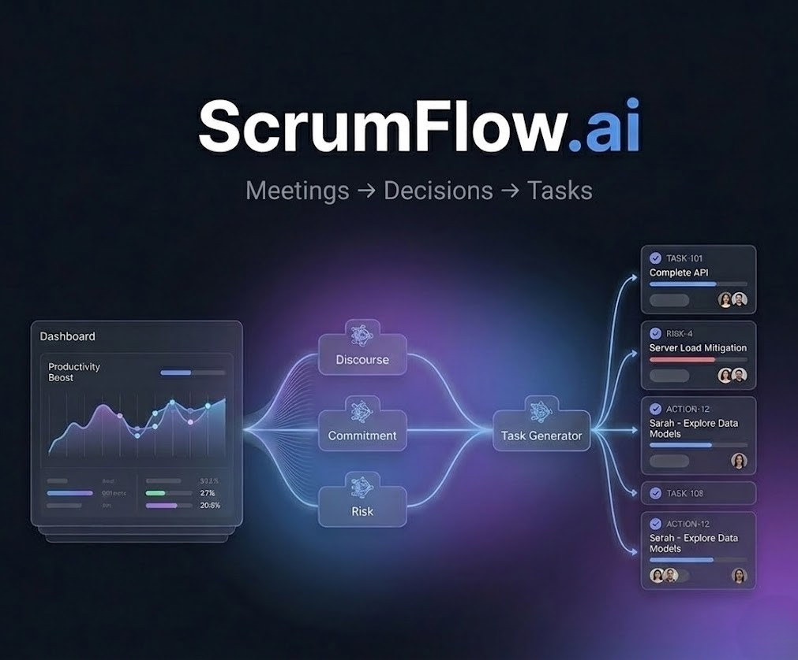
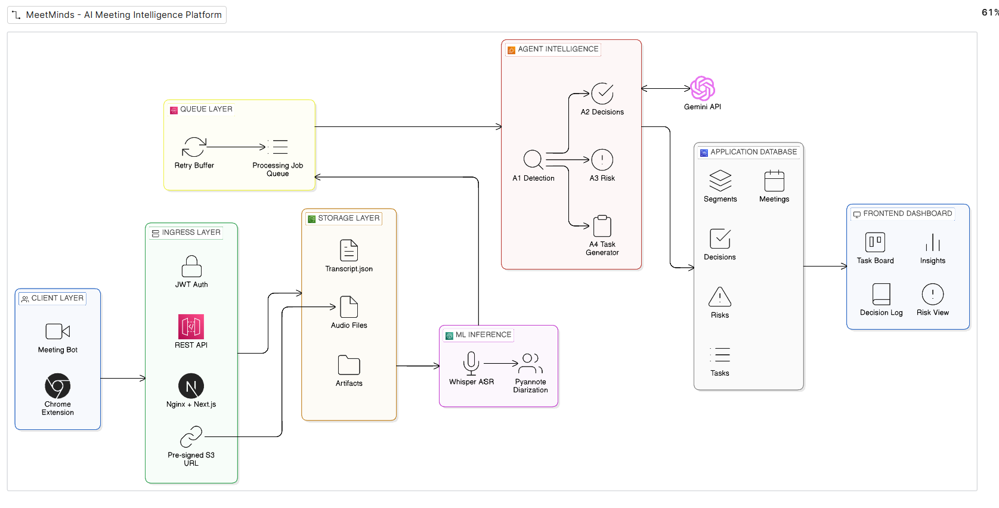

# AIdeas: ScrumFlow.ai -- Intelligent Sprint Automation Tool

**Team: MeetMinds AI**

---

*Meetings into Decisions. Decisions into Tasks. Automatically.*

---

Marcus closes his laptop at 10:47 AM. Sprint planning is done. Priorities locked, owners assigned, the database migration risk flagged and discussed. He heads to lunch feeling good.

Wednesday morning, his Slack lights up:

> *"Hey, who's owning the integration task? I thought it was you."*
> *"Are we shipping the auth feature this sprint or pushing it?"*
> *"Did anyone follow up on the migration blocker?"*

The meeting happened. The alignment didn't survive it.

**Decisions made out loud don't count. Not until they're written down, owned, and tracked.**

ScrumFlow.ai was built for exactly that moment: between the meeting ending and the work beginning.

---

## App Category

**Workplace Efficiency**

ScrumFlow.ai eliminates the structural collapse of alignment that happens the moment a meeting ends. It automatically converts sprint conversations into decisions, tasks, risks, and commitments, without manual effort, removing the rework and confusion that bleeds velocity across every sprint.

---

## My Vision

Every sprint planning session generates shared understanding. For about 45 minutes, everyone is aligned. Then the meeting ends, and that understanding starts to disappear.

ScrumFlow.ai is an **AI-powered sprint intelligence platform** that transforms meeting recordings into structured execution artifacts: decisions with owners, tasks with context, risks with severity scores, and commitments that are tracked, not just remembered.

**The vision is not to replace meetings.** Conversations are where alignment happens. The vision is to ensure that alignment *survives* the meeting. Every decision made out loud becomes a documented, owned, trackable artifact before the day is over.

### What I Built

A platform that processes sprint planning recordings through a multi-agent AI pipeline and produces:

- **Structured decision logs:** what was decided, by whom, with context
- **Risk registers:** blockers and dependencies detected from the conversation
- **Commitment records:** who said they would do what, by when
- **Tasks with dependencies:** generated from all of the above, ready for immediate execution
- **Smart allocation suggestions:** matching tasks to team members by skill and availability

The core strategy combines three pillars:

**Multi-Agent Reasoning Architecture:** Specialized agents each analyze one dimension of the conversation (topics, decisions, risks) and synthesize their outputs into structured, execution-ready sprint artifacts.

**Persistent Organizational Memory:** Every meeting produces a structured record of what was decided, who committed, what risks were raised, and what needs to happen next. This is stored as queryable intelligence that compounds across sprints rather than expiring when the call ends.

**Execution Feedback Loop:** Decisions flow into tickets, tickets into completed tasks, and completed tasks feed back into the next planning cycle. The system closes the loop automatically. Alignment doesn't just happen in the meeting; it drives execution after it.

---

## Why This Matters

The problem isn't meetings. Teams need to talk, debate, and align. That's work, not waste. The problem is what happens to everything generated inside those conversations when the call ends.

**The scale:**
- Average employee spends **11.3 hours/week** in meetings (Fellow, 2024)
- Managers average **13 hours**, executives **23 hours** (HBR)
- **67% of meetings** end without clear action items (Lucid Meetings)
- US businesses lose **$259 billion/year** to unproductive meetings (LSE, 2024)

This is **Verbal Debt**, the organizational equivalent of technical debt. Every undocumented decision, every verbally assigned task, every flagged risk that never became a tracked blocker accumulates silently across sprints. A single undocumented decision in sprint planning becomes three Slack threads, two misaligned engineers, one delayed release. Multiply that across every sprint and the cost becomes a structural drag on execution.

The root cause isn't poor communication. Teams are communicating constantly. The root cause is the absence of *Persistent Organizational Memory*- and without it, every meeting starts from scratch. Context is rebuilt from memory. Decisions are relitigated. Velocity bleeds out in the space between conversations.

Most teams patch this with better note-taking. It helps, but it doesn't solve the underlying problem. Someone still has to manually convert conversation into structure. Manual conversion is slow, inconsistent, and unreliable.

What teams need isn't better note-taking it's a system that captures structure automatically, at the moment the conversation happens. Every decision documented. Every commitment owned. Every sprint building on the one before it. That's not a productivity tip. That's an architectural requirement.

That's the gap ScrumFlow.ai closes.

### How ScrumFlow.ai Differs from Traditional Meeting Tools

| Capability | Traditional Tools | ScrumFlow.ai |
|---|---|---|
| Primary focus | Transcription and summaries | Conversation to execution intelligence |
| Output | Raw transcript or summary text | Decisions, commitments, risks, tasks |
| Decision tracking | Buried in summaries | Explicit extraction with ownership |
| Task generation | Manual, post-meeting | AI-generated from commitments |
| Risk identification | Not detected | Blockers and dependencies surfaced |
| Accountability | Manual follow-up | Tasks linked to owners |
| Organizational memory | Documents | Structured, queryable intelligence |

---

## How I Built This

The solution had to be structural. ScrumFlow.ai is built on a cloud-native AWS architecture paired with a multi-agent AI reasoning pipeline, designed to convert raw meeting conversations into structured execution artifacts.

The core insight: break meeting understanding into **specialized agents**, each responsible for one analytical dimension. This reduces prompt complexity, improves accuracy, and makes the system reliable enough to act on without human verification of every output.

### System Architecture

### AWS Services Used

| Service | Justification |
|---|---|
| **Amazon EC2** | Hosts the API ingress layer and the agent intelligence layer. EC2 gives direct control over the Python runtime and dependency environment needed for the multi-agent pipeline. |
| **Amazon S3** | Object storage for raw audio uploads and intermediate transcript artifacts. S3's event notifications also trigger downstream processing steps, keeping the ingestion path fully decoupled. |
| **Amazon SQS** | Decouples audio upload from processing. A spike in meeting uploads queues work without cascading into pipeline failures; each stage retries independently on transient errors, making the pipeline fault-tolerant by design. |
| **Amazon RDS (PostgreSQL)** | Relational storage for structured pipeline outputs: decisions, commitments, risks, tasks, and allocation suggestions. RDS handles the relational joins needed when the dashboard queries task-to-decision traceability. |
| **Amazon EC2 (ML)** | Runs Whisper and Pyannote directly on EC2 for speech recognition and speaker diarization. Keeping inference on EC2 avoids cold start latency and simplifies the deployment stack at the current prototype scale. |
| **Kiro (Agentic IDE)** | Spec-driven development tool used throughout the build. Kiro generated structured specs, scaffolded AWS service integration patterns, and kept design documents in sync with code changes via automated hooks. |

### Resource Optimization Strategies

The table below compares ScrumFlow.ai's current architecture against alternative deployment options (ap-south-1 region). The current EC2-only setup was chosen for prototype simplicity; the Hybrid SageMaker path is the planned production trajectory.

| Architecture | Services Used | Est. Monthly Cost | Scalability | Pros | Cons |
|---|---|---|---|---|---|
| **EC2-Only (Current)** | EC2 (t3.large), EC2 (c6i.xlarge), S3, RDS, SQS, Pyannote API, Gemini API | $250-300 | Medium | Lowest complexity, predictable cost, no cold starts | Manual autoscaling setup, CPU transcription slower |
| **Hybrid SageMaker** | EC2 (t3.large), SageMaker (ml.g5.xlarge), S3, RDS, SQS, Pyannote API, Gemini API | $150-200 | Very High | No idle GPU cost, elastic scaling, managed ML inference | Cold start latency, container orchestration required |
| **Bedrock AI** | EC2 API server, AWS Bedrock, S3, RDS, SQS, Pyannote API | $120-180 | Extremely High | Fully managed AI inference, simplest architecture | Vendor lock-in, token cost at scale |
| **Fully Managed (SageMaker + Bedrock)** | EC2 API server, SageMaker processing, Bedrock agents, S3, RDS, SQS | $180-250 | Extremely High | Near-zero infrastructure maintenance, auto-scaling | Highest complexity, cost scales with usage |

**External AI API Costs**

| API | Purpose | Estimated Cost |
|---|---|---|
| Pyannote API | Speaker diarization | ~$0.16 / hr audio |
| Gemini 2.5 Flash | Alignment + agent reasoning | ~$0.35 / 1M tokens input |
| OpenRouter Llama 70B | Fallback inference | ~$0 |

At scale (200 meetings/month), EC2 costs grow proportionally while S3 and SQS remain near-flat. Moving to reserved EC2 instances and adopting Savings Plans would reduce compute costs by 30-40% at that volume.

---

### The Multi-Agent Intelligence Layer

#### Models Used

| Model | Role |
|---|---|
| **Oriserve/Whisper-Hindi2Hinglish-Apex** | Multilingual Speech to Text Transcription |
| **Pyannote - Precision 2** | Speaker Diarization |
| **Gemini 3 Flash** | Transcription and Diarization alignment |
| **Gemini 2.5 Flash** | Primary reasoning model for all agents |
| **Llama 3.3 70B** (via OpenRouter) | Automatic fallback if Gemini fails |

Both models return strict JSON schemas validated by Pydantic. On schema failure, the pipeline retries automatically in "concise mode" (tighter constraints, higher confidence threshold) to achieve near-complete schema compliance in production.

---

#### Agent 1 -- Discourse Agent

**What it does:** Segments the conversation into coherent topic blocks, identifying where the team shifted focus (e.g., "Sprint Scope" to "Database Migration Risk").

**Why it matters:** Downstream agents analyze topic-scoped segments rather than the full transcript, reducing noise and improving extraction precision.

**Model:** Gemini 2.5 Flash. Its long context window handles full-length meetings and its fast inference enables near-real-time processing.

---

#### Agent 2 -- Commitment Agent

**What it does:** Identifies ownership and accountability from the conversation, extracting who committed to deliver what, by when, and any blockers mentioned.

**Key extractions:**
- Speaker name and role (inferred from context when not stated explicitly)
- The specific deliverable committed to
- Deadline (parsed from "end of sprint", "before standup", etc.)
- Related decisions and blockers

**Why it matters:** Verbal commitments die without structure. This agent turns "I'll handle it" into a traceable record with an owner and a deadline.

---

#### Agent 3 -- Risk Agent

**What it does:** Detects blockers, dependencies, and risk signals before they derail the sprint.

**Key extractions:**
- Risk description and category (technical, resource, external dependency, scope, deadline)
- Severity score (probability x impact)
- Proposed mitigation and risk owner

**Why it matters:** Teams mention risks conversationally without formally logging them. This agent catches what would otherwise get buried in the transcript.

---

#### Agent 4 -- Task Generator (Sequential)

**What it does:** Takes the outputs of all three parallel agents and synthesizes structured task objects with dependency edges.

**How it works:**
1. Each commitment becomes a candidate task
2. Decision context added for traceability
3. Acceptance criteria generated from discussion specifics
4. Blockers identified from risk analysis
5. Dependency edges mapped between tasks

**Why sequential:** Task generation requires the complete output of the other three agents; it cannot run in parallel.

---

### Post-Processing Layer (No LLM)

After the agents complete, a pure Python post-processor computes:

**Meeting Metrics:** Duration, decision count, and decision density (decisions per minute), which is a useful signal for whether meetings produce outcomes or just discussion.

**Risk Quantification:** Counts by category: dependency risks, resource constraints, and deadline risks.

**Task Allocation Scoring:** Each task is scored against each team member using `skill_match x availability_factor = allocation_score`, producing ranked suggestions with the top candidate and alternatives.

---

### Development with Kiro

Kiro, Amazon's agentic IDE, was central to how ScrumFlow.ai went from concept to working system.

**Spec-Driven Development.** I described requirements in natural language covering the processing pipeline, multi-agent flow, and data models for decisions, commitments, risks, and tasks, and Kiro generated structured specification files (`requirements.md`, `design.md`, `tasks.md`) using EARS notation. Every component's purpose and acceptance criteria were explicit before any implementation began. The agents themselves originated as discrete spec entries, not prompts.

**Pipeline Scaffolding.** The multi-stage pipeline involves multiple AWS services coordinated across asynchronous boundaries. Kiro scaffolded the foundational patterns: SQS message schemas, RDS connection pooling, and the shared agent interface contract that lets Discourse, Commitment, and Risk agents run in parallel without coupling.

**Consistency via Hooks.** Kiro's automated hooks fired on file saves and code changes, keeping specs, design documents, and task lists in sync with the evolving codebase. When an agent's output schema changed, downstream consumers were validated automatically rather than drifting silently until runtime.

There's an irony in using a spec-driven development tool to build a system whose entire purpose is to enforce structure on unstructured conversation. Both ScrumFlow.ai and Kiro solve the same underlying problem: decisions made informally don't survive unless they're captured, structured, and tracked.

---

## Demo

The workflow is three steps:

**1. Upload Meeting:** The meet recording (MP3, MP4, WAV) gets uploaded through the extension.

**2. AI Processing:** The system transcribes the meeting, runs diarization to attribute speech to speakers, and executes the multi-agent pipeline. Three agents run in parallel; the Task Generator runs after all three complete.

**3. View Insights:** Instead of navigating a transcript, teams immediately see the decisions made, risks surfaced, commitments identified, and tasks generated from the conversation.

---

*The pipeline running in the terminal: phases, parallel agents with spinners, and the final summary panel*

---

*Main dashboard showing model accuracy trend, override rate, recent allocation suggestions, and meeting importance scores*

---

*Meeting importance page with ScrumFlow.ai Demo Video Planning selected, showing key discussion points, decisions made, and the importance scoring formula*

---

*Speaker analysis sidebar showing speaking time distribution, turn counts, and interruption data per participant*

---

*Diarized transcript view with every utterance attributed to its speaker and timestamped, displayed in Hinglish as recorded*

---

*Speaker Metrics page with speaking time distribution, donut chart, turn count, and interruption statistics for the full sprint meeting*

---

*Upcoming Meeting Calendar in weekly view with the meeting details panel showing participants, duration, budget tier, and importance score*

---

*Task Overview listing all 11 AI-generated tasks with complexity scoring, dependency count, cross-team impact, and historical completion rate*

---

*Task detail modal showing description, complexity breakdown, estimated hours, assignee, and links to allocation history and dependencies*

---

*Task Dependency Graph visualizing task relationships and sequencing requirements surfaced from the meeting conversation*

---

*Allocation Engine showing AI-generated assignment suggestions with skill match %, load fit %, confidence score, and reasoning for each task*

---

*Modify Assignee modal for overriding the AI suggestion with reason logging, showing alternative candidates ranked by skill and load*

---

## What I Learned

I built ScrumFlow.ai because I lived the problem. I've been in that meeting where everything gets decided, everyone leaves nodding, and three days later the same questions appear in Slack as if the conversation never happened.

The frustration isn't the missed deadline. It's knowing the team did everything right: showed up, discussed, aligned, and execution still fell apart. That's not a people problem. That's a structural one.

**Single prompts don't scale to real conversations.** Early prototypes fed entire transcripts into one LLM prompt. It worked on clean, short recordings. On real meetings with interruptions, topic switches, and overlapping commitments, it produced inconsistent results. Splitting reasoning across specialized agents changed everything. When the Discourse Agent only thinks about topics, the Commitment Agent only thinks about ownership, and the Risk Agent only thinks about blockers, each one gets dramatically better at its specific job. Separation of concerns is good software architecture. It's also good reasoning architecture.

**Infrastructure is harder than intelligence.** The most time-consuming challenges had nothing to do with prompts or models. They were about orchestration. Keeping EC2, S3, SQS, and RDS coordinated across an async multi-stage pipeline without losing data or creating silent failures is genuinely hard engineering. Building AI applications is less about what the model knows and more about whether the plumbing holds under pressure. Idempotency and observability are non-negotiable.

**Asynchronous architecture is not optional.** The first version processed everything synchronously. It worked for one meeting and fell apart under load. Introducing SQS to decouple transcription from analysis wasn't an optimization, it was a correctness fix. Upload spikes now get absorbed by the queue; failed stages retry independently.

**Explicit structure accelerates development.** Kiro forced every requirement, design decision, and acceptance criterion to be explicit before implementation began. This prevented the class of bugs that come from informal assumptions, which is exactly the same problem ScrumFlow.ai solves for teams in meetings.

---

## Conclusion

That's the version worth building: not a smarter note-taker, but a system that remembers what your team decided, holds people accountable to what they committed, and makes every future meeting faster because the last one was fully captured.

Meetings aren't the problem. Losing what happens inside them is.

Every decision documented. Every commitment tracked. Every meeting building on the last. That's not a feature set, that's a compounding organizational advantage.

**ScrumFlow.ai exists so teams stop losing.**

---

## Article Tags

**#aideas-2025** | **#workplace-efficiency** | **#APJC**

## Team

- Aditya Kumar Singh 
- Mayank Sharma
- Aayush Jha
- Harsh Kumar
